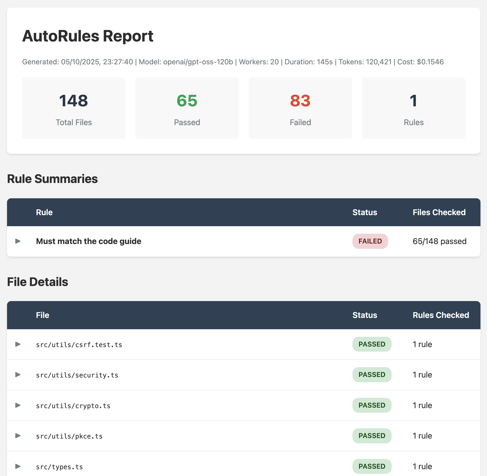

# AutoRules

Automated code quality checking with AI. Define rules in natural language and let AI check your entire codebase against them.



## Features

- 🤖 AI-powered code analysis using any OpenRouter model
- 📝 Define rules in natural language using Markdown files
- 🚀 Parallel processing with configurable workers
- 📊 Interactive HTML reports with expandable details
- 🎯 Glob pattern support for targeting specific files
- 💰 Token usage and cost tracking
- 🖥️ Real-time TUI progress display

## Installation

```bash
npm install -g autorules
```

Or use locally in your project:

```bash
npm install --save-dev autorules
```

## Quick Start

1. Create an `autorules` folder in your project
2. Add rule files (`.md` format) with this structure:

```markdown
title: No console.log statements
files: **/*.js
---

This file should not contain any console.log statements in production code.
```

3. Run AutoRules:

```bash
export OPENROUTER_API_KEY=your_key_here
autorules --workers=3
```

## Rule File Format

Each rule file must have:

- **Frontmatter**: `title` and `files` (glob pattern)
- **Separator**: `---`
- **Criteria**: Natural language description of the rule

Example:

```markdown
title: Proper error handling
files: src/**/*.ts
---

Every async function should have proper error handling with try-catch blocks or error callbacks.
```

## CLI Options

```
Usage: autorules [options]

Options:
  -w, --workers <number>     Number of parallel workers (default: 3)
  -r, --report <format>      Report format: html (default: html)
  -m, --model <model>        AI model to use (default: openai/gpt-oss-120b)
  -k, --api-key <key>        OpenRouter API key (or set OPENROUTER_API_KEY env var)
  -o, --output <path>        Output path for report (default: autorules-report.html)
  --provider <name>          Filter to only use specific provider (e.g., Cerebras)
  --provider-sort <method>   Sort providers by method (e.g., throughput)
  -h, --help                 Show this help message
```

## Examples

### Basic Usage

```bash
autorules
```

### Custom Workers and Model

```bash
autorules --workers=5 --model=anthropic/claude-3-opus
```

### Custom Output Location

```bash
autorules --output=./reports/code-quality.html
```

### Using API Key

```bash
autorules --api-key=sk-or-v1-xxxxx
```

### Using Specific Provider

```bash
autorules --provider=Cerebras --provider-sort=throughput
```

## Example Project Structure

```
my-project/
├── src/
│   ├── index.js
│   └── utils.js
├── autorules/
│   ├── no-console.md
│   ├── proper-naming.md
│   └── security-checks.md
└── package.json
```

## Example Rules

Each rule uses a simple frontmatter block. Alongside `title` and `files`, you can optionally provide an `includes` entry that points (relative to the rule file) to supporting guidance that should be embedded in every prompt.

### No Hardcoded Secrets

```markdown
title: No hardcoded secrets
files: **/*.{js,ts,py}
---

This file should not contain any hardcoded API keys, passwords, or other secrets. Look for patterns like API_KEY=, password=, or similar.
```

### Consistent Naming Convention

```markdown
title: Consistent naming
files: src/**/*.js
---

Function names should use camelCase and be descriptive. Variable names should also use camelCase.
```

```markdown
title: Test files required
files: src/**/*.js
---

For every source file, there should be a corresponding test file. Check if this pattern is followed.
```

### Rule With Shared Specification

```markdown
title: Must match the code guide
files: docs/**/*.md
includes: ../specs/CODE_GUIDE.md
---

Confirm that this file follows the shared documentation standards defined in the included guide.
```

## HTML Report

The generated HTML report includes:

- **Dashboard**: Summary statistics and metadata
- **Results Table**: All checked files with pass/fail status
- **Expandable Details**: AI responses, token usage, and costs
- **Interactive UI**: Click to expand/collapse detailed responses

## How It Works

1. **Scan**: Finds all `autorules` folders in your project
2. **Parse**: Loads rule files and extracts criteria
3. **Match**: Uses glob patterns to find files to check
4. **Analyze**: Sends each file to AI with the rule criteria
5. **Report**: Generates interactive HTML report with results

## API Key Setup

Get your API key from [OpenRouter](https://openrouter.ai/) and either:

1. Set environment variable:
   ```bash
   export OPENROUTER_API_KEY=your_key_here
   ```

2. Use CLI flag:
   ```bash
   autorules --api-key=your_key_here
   ```

## Development

```bash
# Clone the repo
git clone https://github.com/markwylde/autorules.git
cd autorules

# Install dependencies
npm install

# Build
npm run build

# Run locally
node dist/cli.js
```

## License

MIT
